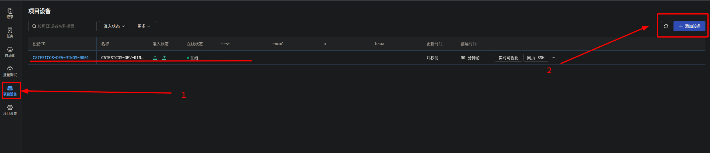
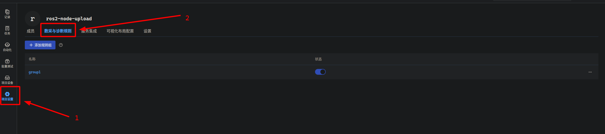
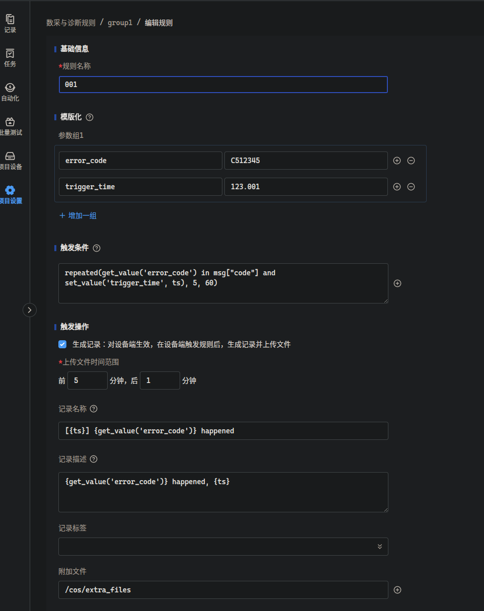

# coListener

## 测试流程

### 机器人端

* 将coListener-main.zip 解压至 ros2 workspace 的 `src` 文件夹内

* 安装coScout（数采组件）、coLink（远程控制组件），详细安装说明见刻行官网。

* 安装python依赖库

  ```bash
  pip3 install -r ./coListener/requirements.txt
  ```

* 编译 coListener

  * launch 文件参数及其默认值如下（**请在编译前按照需求进行修改**）：
    ```python
    bag_storage_path = "/cos/files"    # bag的存储路径
    error_code_topic = "/error_code"   # 发布error code的topic
    use_service = False                # 是否调用service进行录包（当前按照False）
    waiting_data_minutes = 60          # 数据检测超时时间（若{waiting_data_minutes} 分钟后未能收集到全部数据，直接上传已经收集到等数据）
    ```
  * 编译 & 运行
    ```bash
    colcon build --packages-select coListener
    ros2 launch coListener coListener.launch.py
    ```

### 网站端
* **登录网站准入设备**

  

* 创建项目并将设备添加进项目

  

* 创建规则
  
  
  
